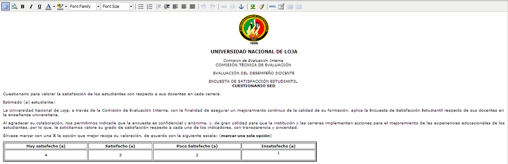

.. _questionary-title:

*************
Cuestionarios
*************

.. _questionary-new:

Crear un cuestionario
=====================

Para ingresar un cuestionario se debe seleccionar la opción **Cuestionarios** de la lista de opciones(ver imagen :ref:`systemAccess-img-sistemAccess_administrative_site`  ). El sistema presenta los cuestionarios ya ingresados y que se pueden editar, al cual usted puede acceder para
modificarlo o a su vez puede crear uno nuevo haciendo clic en la parte superior derecha como se muestra a continuación:

.. _questionary-img-questionary_main_option:

    **Menú Cuestionarios**

Para crear un nuevo Cuestionario podemos hacerlo de 2 maneras, una directa usando el boton **Añadir** o haciendo clic en la opción Cuestionarios y a continuación en **Añadir cuestionario**. Ver la siguiente imagen:

.. _questionary-img-questionary_buton_new:

    **Crear un cuestionario**

A continuación se abre una pestaña con la plantilla y opciones necesarias para crear un nuevo cuestionario:

.. _questionary-img-questionary_new:

    **Cuestionario en blanco**

.. _questionary-options:

Información de campos y opciones en Cuestionarios
*************************************************
La opciones disponibles son:

    • **Nombre:** Nombre que se le asigna al cuestionario y con el cual se lo identificará dentro del Sistema    
    • **Título:** Título para el cuestionario, dicho título será visible por los estudiantes el momento que desarrollen la encuesta.
    • **Encabezado:** Constituye el encabezado que presentará la encuesta, es recomendable, en esta sección, añadir parametros como una presentación y nociones sobre como desarrollar la encuesta(ver imagen :ref:`questionary-img-questionary_edit_encabezado`).
    • **Inicio de la Encuesta:** Fecha y hora en que se abrirá la encuesta para el publico.
    • **Finalización de la Encuesta:** Fecha y hora en que la encuesta será cerrada.
    • **Preguntas obligatorias:** Esta opción debe estar seleccionada con el fín de garantizar que todas las preguntas serán respondidas.
    • **Informante:** A quien va dirigida la encuesta
    • **Peso:** Valor que será asignado a cada pregunta, necesario para realizar un posterior promedio
    • **Periodo de Evaluación:** Permite seleccionar el periodo en que se desarrollara la encuesta. El mismo que previamente debió ser creado.

En la siguiente imagen vemos un ejemplo de como debería quedar el encabezado:

.. _questionary-img-questionary_edit_encabezado:

    **Edición de encabezado**

Al terminar de editar la encuesta debe presionar el botón grabar como se muestra en la imagen :ref:`questionary-img-questionary_edit`. El sistema guarda todos los cambios.

.. El sistema presentara nuevamente la lista de opciones que puede realizar el administrador en cuanto a la aplicación se aclara que es la misma lista presentada en la imagen :ref:`systemAccess-img-sistemAccess_administrative_site`.

.. 
    .. _questionary-img-questionary_complete:

..    .. figure:: ../../_static/questionary/questionary_complete2.png 
        :align: center
        :alt: Cuestionario con todos los campos
        :figclass: align-center

..        **Cuestionario completo**

.. _questionary-edit:

Modificar Cuestionario
======================
Para realizar una modificación sobre aun cuestionario, partimos haciendo clic sobre el misma y procedemos a la edición de campos presentada en la sección anterior(ver :ref:`questionary-options`)

.. _questionary-img-questionary_list:

    **Lista de Cuestionarios**

Una vez realizados los cambios se procede a **Guardar**:

.. _questionary-img-questionary_edit:

.. figure:: ../../_static/questionary/questionary_edit.png 
    :align: center
    :alt: Cuestionario completo
    :figclass: align-center

    **Cuestionario completo**

Para eliminar un questionario basta con hacer clic en la opción **eliminar** ubicada en la parte inferior izquierda de la pantalla. Posteriormente se solicitará una confirmación, una vez aceptada se eliminara el questionario de la Base de Datos

.. _evaluation-img-questionary_option_delete:

.. figure:: ../../_static/questionary/questionary_option_delete.png 
    :align: center
    :alt: opción eliminar Cuestionario
    :figclass: align-center

    **Opción Eliminar Cuestionario**