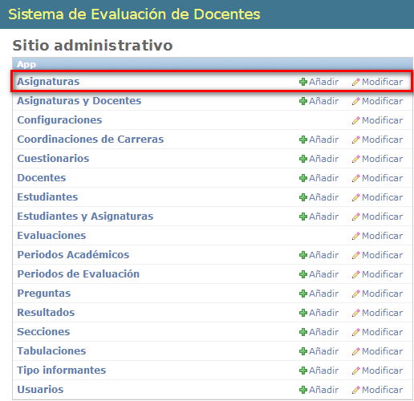
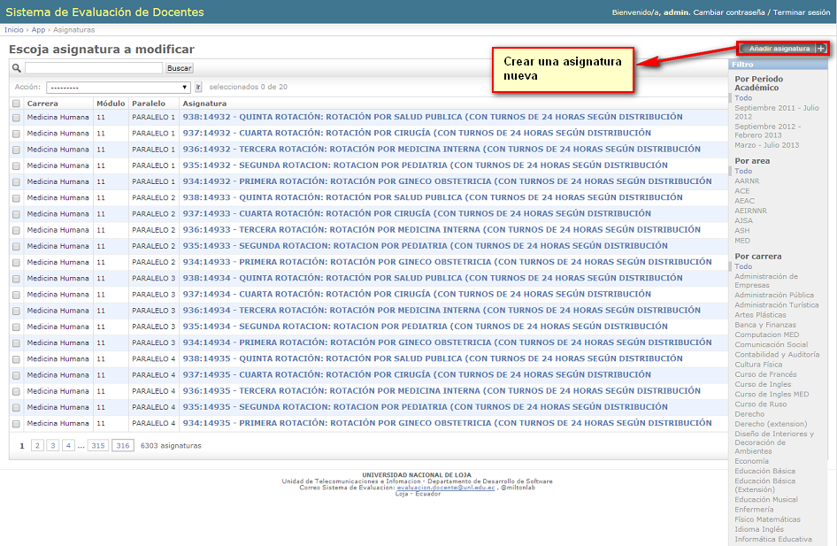
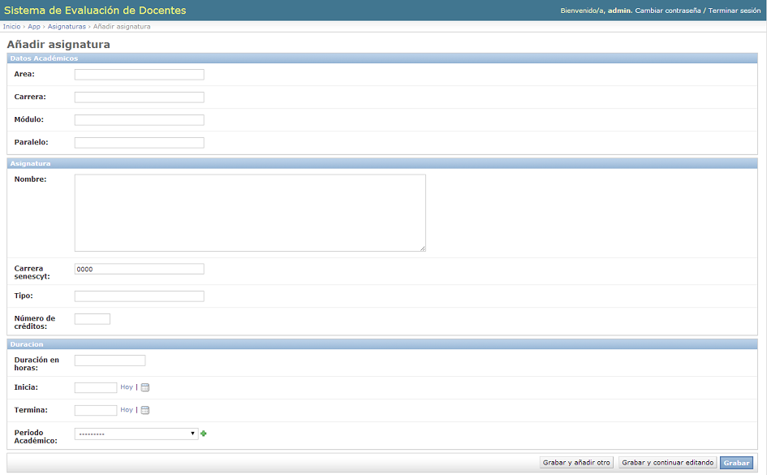
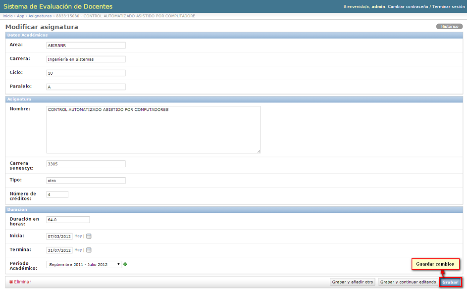
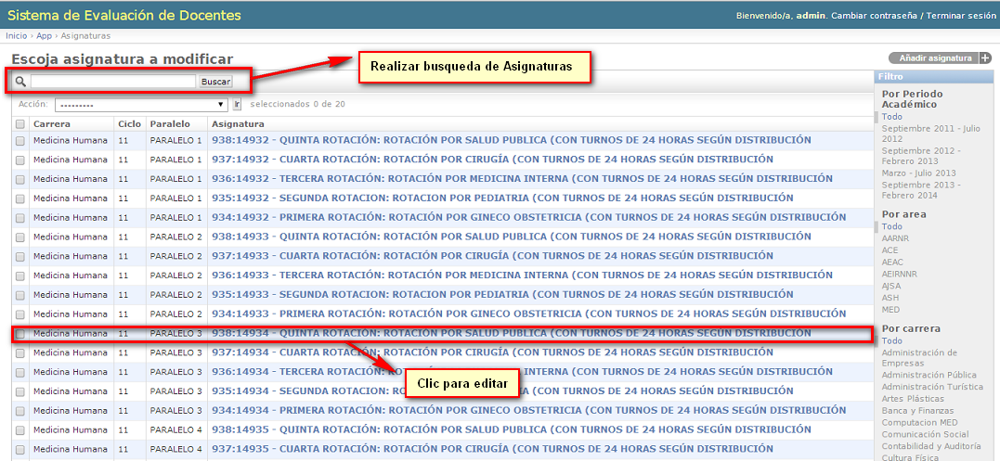
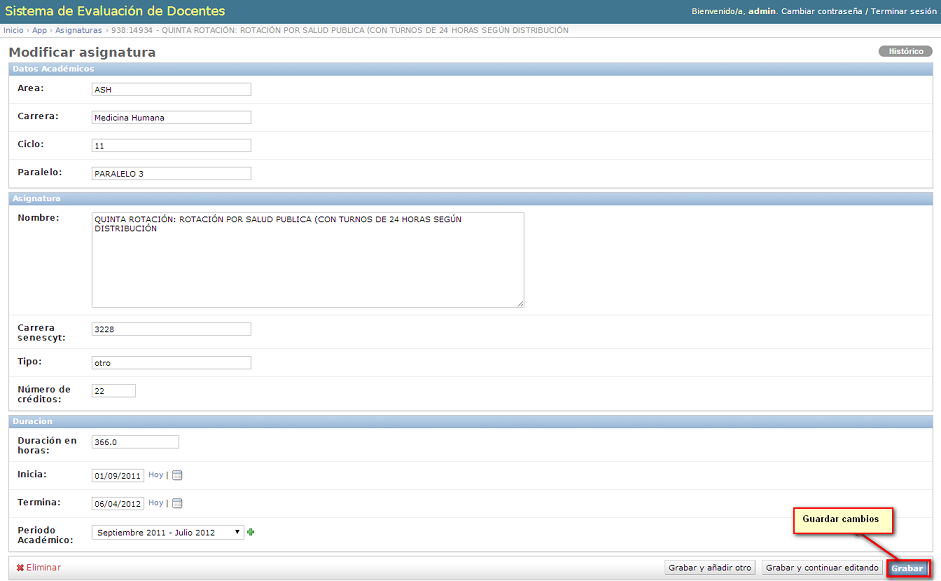

.. _signature-title:

***********
Asignaturas
***********

.. _signature-new:

Crear Asignaturas
=================

Similar a procesos anteriores, partiendo desde el sitio administrativo (ver imagen :ref:`systemAccess-img-sistemAccess_administrative_site`) seleccionamos la opción Asignaturas como se ve acontinuación:

.. _signature-img-subject_main_subject:

    **Menú Asignaturas**

A continuación se despliega una lista con las Asignaturas pertenecientes a las distintas carreras universitarias. En la parte superior derecha se presenta la opción agregar Asignatura:

.. _signature-img-subject_buton_new:

    **Opción Crear Nueva Asignatura**

Se presentan los campos y opciones necesarias para crear una nueva Asignatura:

.. _signature-img-subject_new:

    **Asignatura con campos vacios**

.. _signature-options:

Información de campos y opciones de Asignaturas
***********************************************

Detallando cada campo: (ver imagen :ref:`signature-img-subject_complete`)

	• **Área:** Se escribe el área a la que pertenece la presente asignatura.
	• **Carrera:** Se escribe la carrera a la que pertenece la presente asignatura.
	• **Ciclo(Módulo):** Se escribe el módulo en la cual de estudia la presente asignatura.
	• **Paralelo:** Se escribe el paralelo en el cual se va a dictar la presente asignatura.
	• **Nombre:** Se escribe el nombre que va a poseer la presente asignatura.
	• **Carrera Senescyt:** Código asignado por el Senescyt como identificativo para cada carrera.
	• **Tipo:** Se escribe el tipo de la presente asignatura.
	• **Numero de créditos:** Se escribe el número de créditos, es decir el valor que aporta la presente asignatura.
	• **Duración en Horas:** Se determina el número de horas en las cuales se va a dictar la presente asignatura.
	• **Inicia** Se determina la fecha en la cual se va a dar inicio la presente asignatura.
	• **Termina:** Se determina la fecha en la cual se va a dar por culminada la presente asignatura.
	• **Período Académico:** Se procede a seleccionar el periodo académico actual, el mismo que ya debió ser creado con anterioridad.

.. _signature-img-subject_complete:

    **Asignatura con campos completos**

.. _signature-edit:

Modificar Asignaturas Existentes
================================
Para realizar una modificación sobre alguna asignatura existente partimos haciendo clic sobre la misma o realizando un filtro (búsqueda) de la misma mediante el nombre de la misma, luego procedemos a la edición de campos presentada en la sección anterior(ver :ref:`signature-options`)

.. _signature-img-subject_edit_list:

    **Lista de Asignaturas**

Una vez realizados los cambios se procede a **Guardar**:

.. _signature-img-subject_edit_save:

    **Edición de Asignatura**

Para eliminar una Asignatura basta con hacer clic en la opción **eliminar** ubicada en la parte inferior izquierda de la pantalla. Posteriormente se solicitará una confirmación, una vez aceptada se eliminara la Asignatura de la Base de Datos:

.. _signature-img-subject_option_delete:

.. figure:: ../../_static/signature/subject_option_delete.png 
    :align: center
    :alt: Opción Eliminar Asignatura
    :figclass: align-center

    **Opción Eliminar Asignatura**